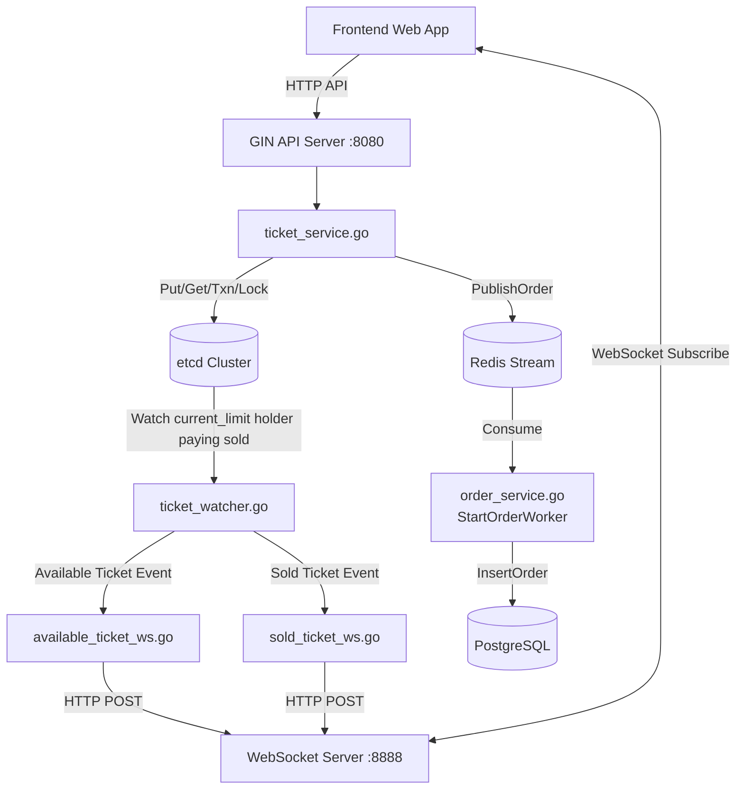

# etcd-ticket

## 專案目錄

### 1. root

````
etcd-ticket/
├── backend/        # Go (API + etcd + WebSocket)
├── frontend/       # React
├── docker/         # (選用) etcd / 部署
├── scripts/        # 測試 & 壓測
├── README.md

````

### 2. backend (Go)

- etcd1: 2379
- etcd2: 2381
- etcd3: 2382
- api gateway: 8080

```

backend/
├── cmd/
│   └── server/
│       └── main.go              # 入口點（初始化 DB、Redis、etcd、啟動 worker）
│
├── internal/
│   ├── api/                     # HTTP handler
│   │   ├── handler.go
│   │   ├── ticket.go            # 搶票 API
│   │   └── ws.go                # WebSocket
│   │
│   ├── service/                 # 商業邏輯
│   │   ├── ticket_service.go    # etcd 搶票核心（Lock_And_Hold、Checkout）
│   │   ├── ticket_watcher.go    # 監聽   
│   │   └── order_service.go     # 訂單發布與消費（PublishOrder、StartOrderWorker）丟給 Redis
│   │
│   ├── watcher/                 # watch 機制
│   │   ├── available_ticket_ws.go
│   │   └── sold_ticket_ws.go
│   │
│   ├── repository/              # DB 操作封裝
│   │   └── order_repo.go        # InsertOrder() 寫入 PostgreSQL
│   │
│   ├── mq/                      # Message Queue
│   │   └── redis_stream.go      # Redis Stream（Publish、Consume、Ack）
│   │
│   ├── db/                      # PostgreSQL 連線
│   │   ├── postgres.go          # 連線池 singleton（pgxpool）
│   │   ├── docker-compose.yaml  # 啟動 PostgreSQL + Redis 容器
│   │   └── schema.sql           # orders 資料表定義
│   │
│   ├── etcd/                    # etcd client 初始化
│   │   ├── client.go
│   │   ├── config.yaml          # etcd 3 節點設定
│   │   └── etcd-cluster/
│   │       └── docker-compose.yaml  # 啟動 etcd 3 節點叢集
│   │
│   ├── lock/                    # 分散式鎖
│   │   └── mutex.go

│   │
│   └── model/                   # 資料結構
│       └── ticket.go            # Order struct（對應 orders 表欄位）
│
├── pkg/                         # 可重用工具
│   └── response/
│       └── response.go
│
├── configs/
│   └── config.yaml              # DB DSN、Redis addr 設定
│
├── go.mod
└── go.sum
```

### 目錄說明

- cmd: 初始化整個系統
- api/ 👉 接收 request（Gin handler）
- service/ 👉 搶票邏輯（核心）+ 訂單發布與消費
- repository/ 👉 PostgreSQL 操作（InsertOrder）
- mq/ 👉 Redis Stream 訊息佇列（Publish / Consume / Ack）
- db/ 👉 PostgreSQL 連線池、Schema、Docker 設定
- etcd/
  - etcd-cluster: 三個 etcd 的 docker-compose
  - client: 將三個 etcd 打包成一個單一服務、定義 method
- lock/ 👉 分散式鎖（重點🔥）
- watcher/ 👉 etcd watch → WebSocket 推播

### 3. frontend (React)

- port: 5173

```
frontend/
├── public/
│
├── src/
│   ├── api/                      # 呼叫後端 API
│   │   └── ticketApi.js
│   │
│   ├── components/               # 可重複使用元件
│   │   ├── TicketPanel.jsx       # 顯示剩餘票數
│   │   ├── BuyButton.jsx         # 購票按鈕
│   │   └── StatusBoard.jsx       # 即時狀態顯示
│   │
│   ├── hooks/                    # 自訂 React Hooks
│   │   └── useWebSocket.js       # WebSocket 封裝
│   │
│   ├── pages/                    # 頁面元件
│   │   └── Home.jsx
│   │
│   ├── context/                  # 全域狀態管理
│   │   └── TicketContext.jsx
│   │
│   ├── App.jsx                   # App 主元件
│   └── main.jsx                  # React 入口點
│
├── package.json
└── vite.config.js
```

#### 目錄說明

- api/ 👉 REST API
- hooks/useWebSocket 👉 接 etcd watch 推播（⭐）
- context/ 👉 管理票數狀態
- components/ 👉 UI 分離

### 4. Database & Order Service 說明

搶票成功（Checkout Txn 完成）後，流程如下：

```
Checkout() 成功
    ↓
PublishOrder(ctx, td)             # 成員4 handler 呼叫
    ↓
mq.Publish() → XADD               # 寫進 Redis Stream（持久化）
    ↓
Redis Stream "order:stream"
    ↓
StartOrderWorker() XREADGROUP     # 背景 goroutine 阻塞等待
    ↓
processMessage() → InsertOrder()  # 解析訊息，寫入 PostgreSQL
    ↓
mq.Ack() → XACK                   # 確認消費，移出 pending list
```

#### 啟動 PostgreSQL + Redis

```bash
cd backend/internal/db
docker compose up -d
```

PostgreSQL port：5433（避免與本機預設 5432 衝突）
Redis port：6379

### orders 表結構


| 欄位       | 型別         | 說明                            |
| ---------- | ------------ | ------------------------------- |
| id         | BIGSERIAL    | 自動遞增主鍵                    |
| order_id   | VARCHAR(36)  | UUID，唯一訂單識別碼            |
| user_name  | VARCHAR(100) | 購票用戶名稱                    |
| phone_num  | VARCHAR(20)  | 購票用戶電話                    |
| area       | INT          | 購票區域編號                    |
| status     | VARCHAR(20)  | 訂單狀態（success / cancelled） |
| created_at | TIMESTAMPTZ  | 建立時間（DB 自動填入）         |

### 5. docker (最後實作)

```
docker/
├── docker-compose.yml   # etcd + backend
└── etcd.env
```

## 環境需求

1. NodeJS``` 20.20.2```
2. Go ```1.26.2```

## 如何啟動

安裝完環境以後依照以下步驟

1. 啟動 DB and Redis :5433 :6379

```
// 目錄
cd backend/internal/db

// 啟動
docker-compose up -d
```

2. 啟動 etcd :2379 :2381:2382

```
// 目錄
cd backend/internal/etcd/etcd-cluster

// 啟動 
docker-compose up -d
```

3. 啟動 API Gateway :8080

```
//目錄
cd backend

// 啟動
go run cmd/server/main.go &
```

4. 啟動前端

```
// 目錄
cd frontend

// 啟動
npm create vite@latest .
npm install
npm run dev
```

## Flow Chart


